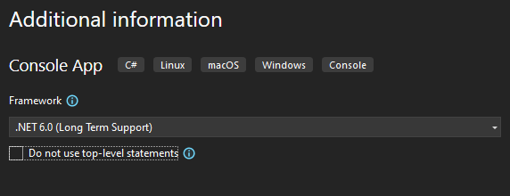
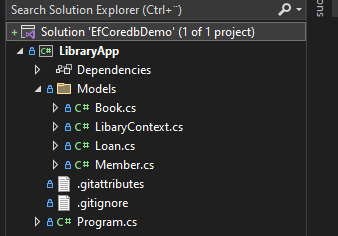
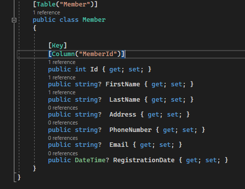

# Kirjasto 

1. Luo itsellesi uusi Console App (C#) Visual studiossa. Valitse "Do not use top level statements"-täppä, jotta saamme perinteisen Program.cs näkymän, jonka avulla testaat tietokannan toimintaa. Tehtävässä tutustutaan "perinteiseen" tapaan tehdä yhteys tietokantaan ja hakea tietoa perinteisien sql-kyselyiden avulla ja LINQa hyödyntäen (https://learn.microsoft.com/en-us/dotnet/csharp/programming-guide/concepts/linq/basic-linq-query-operations). <b>Huom!</b> Voit halutetssasi tutustua myös modernimman Entity Framework Coren käyttöön (https://learn.microsoft.com/en-us/ef/core/).
   
   
  
  
  1.2 Lisää projektiin uusi kansio Models ja sinne luokat Book.cs, Loan.cs, User.cs, DataBaseRepository.cs ja LibraryContext.cs.
    
     
  
  Alla vielä kuva yksittäisestä luokasta.

     
   
 
2. Avaa VisualStudiossa View - Sql Server Object Explorer näkymä. Jos sinulla ei näy kyseistä vaihtoehtoa, niin varmista Visual Studio Installerista, että sinulla on asennettuna "Data Storage and Processing"-lisäosa. Ota alla oleva sql-kysely ja luo sillä itsellesi tietokantaan tarvittavat taulut Sql Server Object Explorerin Querynapin kautta. Huomaa, että sinun tulee luoda tietokanta itsellesi ennen taulujen luomista.

```sql
use Library;

CREATE TABLE Book
(
    BookId INT PRIMARY KEY IDENTITY(1,1),
    Title NVARCHAR(255) NOT NULL,
    ISBN NVARCHAR(13) NOT NULL,
    PublicationYear INT,
    AvailableCopies INT NOT NULL
);

-- Create Member table
CREATE TABLE Member
(
    MemberId INT PRIMARY KEY IDENTITY(1,1),
    FirstName NVARCHAR(255) NOT NULL,
    LastName NVARCHAR(255) NOT NULL,
    Address NVARCHAR(255),
    PhoneNumber NVARCHAR(20),
    Email NVARCHAR(255),
    RegistrationDate DATE NOT NULL
);

-- Create Loan table
CREATE TABLE Loan
(
    LoanId INT PRIMARY KEY IDENTITY(1,1),
    BookId INT FOREIGN KEY REFERENCES Book(BookId),
    MemberId INT FOREIGN KEY REFERENCES Member(MemberId),
    LoanDate DATE NOT NULL,
    DueDate DATE NOT NULL,
    ReturnDate DATE
);
```

3. Lisää tietokantaan testidataa. Varmista, että kaikki toimii.  
```sql
-- Insert sample data into Book table  
INSERT INTO Book (Title, ISBN, PublicationYear, AvailableCopies)
VALUES ('To Kill a Mockingbird', '9780060935467', 1960, 3),
       ('1984', '9780451524935', 1949, 2),
       ('The Catcher in the Rye', '9780316769174', 1951, 4);

-- Insert sample data into Member table  
INSERT INTO Member (FirstName, LastName, Address, PhoneNumber, Email, RegistrationDate)
VALUES ('John', 'Doe', '123 Main St', '555-1234', 'john.doe@example.com', '2020-01-01'),
       ('Jane', 'Smith', '456 Elm St', '555-5678', 'jane.smith@example.com', '2021-05-15');

-- Insert sample data into Loan table  
INSERT INTO Loan (BookId, MemberId, LoanDate, DueDate)
VALUES (1, 1, '2022-01-05', '2022-01-19'),
       (2, 2, '2022-02-10', '2022-02-24'),
       (3, 1, '2022-03-01', '2022-03-15');
```

4. Tutustu alla olevaan sql-kyselyyn. Muokkaa kyselyä niin, että saat lisättyä kymmenen uutta tietuetta Member- ja Book-tauluihin. Voit ajaa kyselyn suoraan SQL Server Management Studiossa. <b> Huom! </b> Tee tämä kunnolla, koska käytät tätä tietokantaa alla olevissa tehtävissä!  
    
```sql

    
INSERT INTO Categories (Name, Description)
VALUES ('Meeting', 'Meetings with colleagues, clients, or partners'),
       ('Conference', 'Conferences or large gatherings'),
       ('Workshop', 'Training workshops and educational sessions'),
       ('Social', 'Social events and gatherings'),
       ('Webinar', 'Online presentations and seminars');
GO

-- Sample data for Users
DECLARE @i INT = 1;
WHILE @i <= 20
BEGIN
    INSERT INTO Users (FirstName, LastName, Email, PasswordHash, Role)
    VALUES ('User' + CAST(@i AS NVARCHAR), 'Lastname', 'user' + CAST(@i AS NVARCHAR) + '@example.com', 'hashedpassword' + CAST(@i AS NVARCHAR), 'User');
    SET @i = @i + 1;
END
GO

-- Sample data for Events
DECLARE @j INT = 1;
WHILE @j <= 20
BEGIN
    INSERT INTO Events (Title, Description, StartDate, EndDate, Location, CategoryId, CreatedBy)
    VALUES ('Event ' + CAST(@j AS NVARCHAR), 'Description for Event ' + CAST(@j AS NVARCHAR), DATEADD(DAY, @j * 3, GETDATE()),
    DATEADD(DAY, @j * 3, DATEADD(HOUR, 2, GETDATE())), 'Location ' + CAST(@j AS NVARCHAR), 1 + (@j % 5), 1 + (@j % 20));
    SET @j = @j + 1;
END
GO
```


5. Nyt sinulla pitäisi olla tietokanta, jossa on tarpeeksi testidataa. Seuraavaksi yhdistämme ConsoleApp-sovelluksemme tietokantaan, jotta voimme hakea sieltä tietoa. Tutustu [Tietokanta ja c#](https://www.codeproject.com/Articles/4416/Beginners-guide-to-accessing-SQL-Server-through-C) artikkeliin ja luo itsellesi tarvittavat metodit DatabaseRepository-luokkaan, etsi Connection String tietokantaasi ja kokeile, että yhteys tietokantaan toimii. Alla mallikoodi luokan alkuasetuksista ja metodista, jolla voit testata yhteyttä.

```c#
using System.Data.SqlClient;

public class DatabaseConnection
{
    private string _connectionString;

    public DatabaseConnection(string connectionString)
    {
        _connectionString = connectionString;
    }

    public string IsDbConnectionEstablished()
    {
       using var connection = new SqlConnection(_connectionString);
        
        try
        {
            connection.Open();
            return "Connection established!";
        }
        catch (SqlException ex)
        {
            throw;
        }
        
        catch(Exception ex)
        {
            throw;
        }
    }
}

```

Alla esimerkki metodista, joka hakee tietokannasta auton valmistajan tietoja. Voit hyödyntää metodipohjaa omissa hauissasi.

```c#
  public List<Brand> GetAllBrands()
  {
      List<Brand> Brands = new();

      using var dbConnection = new SqlConnection(_connectionString); // uusi tapa käyttää using-ominaisuutta. Tämä huolehtii yhteyden sulkemisesta.

      dbConnection.Open(); //avataan yhteys tietokantaan

      using var command = new SqlCommand("SELECT * FROM Brand", dbConnection); // kysely ja tietokannan osoite
      using var reader = command.ExecuteReader(); // olio, jolla luetaan tietoja kannasta
      while (reader.Read()) // silmukka, joka lukee kantaa niin kauan kuin siellä on rivejä, joital lukea
      {
          Brand brand = new() // jokaiselle riville luodaan uusi olio, johon tiedot tallennetaan
          {
              Id = Convert.ToInt32(reader["ID"]),
              Name = reader["Name"].ToString()
          };
          Brands.Add(brand);
      }


      return Brands;
  }

```

6. Tee DataBaseRepository.cs luokkaan metodit, jotka tekevät alla olevat toiminnot. Huom! Voit kokeilla SQL-kyselyjen toimivuutta suoraan kantaa vasten ja vasta sen jälkeen siirtää kyselyn C#-koodiin. Alla olevissa tehtävissä tulee hakea tietoa tietokannasta ja tallentaa ne olioihin (Book, Loan, User):
- Hae kaikki kirjat, jotka on julkaistu viiden vuoden sisällä. Tulosta kirjat konsoliin.
- Hae kirjaston asiakkaiden keski-ikä. Tulosta keski-ikä konsoliin. Jos ikää ei ole, niin lisää syntymäaika tietokantaan.
- Hae kirja, joita on eniten tarjolla kirjastossa. Tulosta kirjan nimi konsoliin.
- Hae jäsenet, jotka lainasivat ainakin yhden kirjan kirjastosta. Tulosta jäsenen nimi ja kirjan ISBN konsoliin.
- (Bonus) Hae kolmen lainatuimman kirjan kaikki tiedot konsoliin. Vihje! Tarvitset useamman Join-lauseen.

7. Tee seuraavat kyselyt käyttäen LINQ-kirjastoa. Nyt voisi olla myös hyvä hetki ainakin käydä katsomassa https://learn.microsoft.com/en-us/ef/core/ ja miettiä voisinko itse käyttää kyseistä frameworkkia hyväkseni.
       
- Hae kaikki kirjat, jotka on julkaistu 10 vuoden sisällä. Tulosta kirjat konsoliin.
- Hae kirjaston asiakkaiden korkein ikä. Tulosta korkein ikä ja asiakkaan nimi konsoliin.
- Hae kirja, joita on vähiten tarjolla kirjastossa. Tulosta kirjan nimi konsoliin.
- Hae jäsenet, jotka eivät lainanneet yhtään kirjaa kirjastosta. Tulosta jäsenen nimi konsoliin.
- (Bonus) Hae kolmen lainatuimman kirjan julkaisuvuosi. Tulosta julkaisuvuosi konsoliin.
   
    
Linq-query syntaksi esimerkki:

```c#  

    private static void GetBooksByVilleQuerySyntas()
    {
      using var context = new LibaryContext();
      var books = context.Books.ToList();
      var booksOfVille = from book in books where book.Title.Contains("Ville") select book;
    }
```
Linq-metodi syntaksi esimerkki:   

```c#
        private static void GetBooksByVille()
            {
            using var context = new LibaryContext();
    
                var books = context.Books.ToList();
                var booksOfVille = books.Where(book => book.Title.Contains("Ville")).ToList(); //method syntax
    
                foreach (var book in booksOfVille)
                {
                    Console.WriteLine($"Book Title: {book.Title}, ISBN: {book.ISBN}, Publication Year: {book.PublicationYear}");
                }
        }
```


