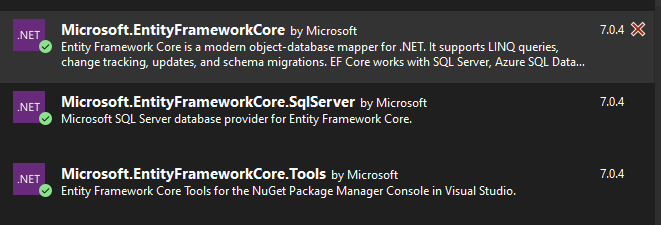

# RpgInventory

1. Luo itsellesi tietokanta alla olevan taulurakenteen mukaan.

## Taulut

### ItemType

| Column    | Type          | Description             |
|-----------|---------------|-------------------------|
| Id        | INT (PK)      | Unique identifier       |
| TypeName  | NVARCHAR(100) | Name of the item type   |

### ItemRarity

| Column     | Type          | Description              |
|------------|---------------|--------------------------|
| Id         | INT (PK)      | Unique identifier        |
| RarityName | NVARCHAR(100) | Name of the item rarity  |

### Item

| Column     | Type                | Description                                   | Relationship                  |
|------------|---------------------|-----------------------------------------------|-------------------------------|
| Id         | INT (PK)            | Unique identifier                             |                               |
| ItemName   | NVARCHAR(100)       | Name of the item                              |                               |
| ItemTypeId | INT (FK)            | Foreign key referencing the item type         | REFERENCES ItemTypes(Id)      |
| RarityId   | INT (FK)            | Foreign key referencing the item rarity       | REFERENCES ItemRarities(Id)   |
| BaseValue  | DECIMAL(10, 2)      | Base value of the item                        |                               |
| AttValue   | DECIMAL(10, 2)      | Attack value of the item                      |                               |
| DefValue   | DECIMAL(10, 2)      | Defence value of the item                     |                               |


2. Luo itsellesi uusi WPF-projekti RPGinventory (tai keksi itse parempi nimi). Varmista, että tarvittavat NuGet-paketit ovat asennettuna, koska tulemme hakemaan tietoa tietokannasta.





3. Luo luokat suoraan tietokantatauluista EFCoren Scaffold-DbContext-komennon avulla. Lisää tietoa scaffoldingista:
(https://learn.microsoft.com/en-us/ef/core/managing-schemas/scaffolding/?tabs=dotnet-core-cli)
(https://learn.microsoft.com/en-us/ef/core/managing-schemas/scaffolding/?tabs=vs)

Löydät oikean konsolin kirjoittamalla EF Core Package Manager Console Package manageriin. Scaffold-komento voisi näyttää esimerkiksi tältä:

```console

Scaffold-DbContext "Server=myServer;Database=myDatabase;Trusted_Connection=True;" Microsoft.EntityFrameworkCore.SqlServer -OutputDir Models
```
Voit ajaa komennon myös powershellillä, jolloin komento on hieman erinäköinen:

```console 
dotnet ef dbcontext scaffold "Data Source=(localdb)\MSSQLLocalDB;Initial Catalog=Chinook" Microsoft.EntityFrameworkCore.SqlServer
```

Olemme tähän asti luoneet luokat manuaalisesti, mutta modernissa kehityksessä on paljon työkaluja, joilla näitä prosesseja saadaan automatisoitua. Onnistuneen komennon jälkeen luokan alun pitäisi näyttää tältä. Luokassa on myös metodi protected override void OnModelCreating(), jota alla ei näy. Tutustu metodin toimintaan. **Huom!** EfCore hoitaa meille tietokannasta datan hakemisen DbSetteihin, joten jos olet aikaisemmissa tehtävissä tehnyt datan haut itse tekemällä select-kyselyjä, niin nyt sinun ei tarvitse sitä tehdä!

```c#
public partial class InventoryContext : DbContext
{
    public InventoryContext()
    {
    }

    public InventoryContext(DbContextOptions<InventoryContext> options)
        : base(options)
    {
    }

    public virtual DbSet<Item> Items { get; set; }

    public virtual DbSet<ItemRarity> ItemRarities { get; set; }

    public virtual DbSet<ItemType> ItemTypes { get; set; }

    protected override void OnConfiguring(DbContextOptionsBuilder optionsBuilder)

        => optionsBuilder.UseSqlServer("Server=(localdb)\\MSSQLLocalDB;Database=RpgInventory;Trusted_Connection=True;");

``` 

4. Tee itsellesi luokka InventoryRepository.cs, johon injektoit InventoryContext.cs luokan. InventoryRepositoryn tehtävänä on huolehtia tietokantaan kohdistuvista operaatioista.

5. Tee alla olevat toiminallisuudet. Voit käyttää kyselyissä perinteistä tapaa tai LINQa.

- Toiminnallisuus, joka hakee kaikki esineet tietokannasta harvinaisuuden (rarity) perusteella. Hyvä esimerkkejä harvinaisuuksille voisivat olla Normal, Magic, Rare, Set ja Unique. Näytä kaikki haetut esineet DataGridView:ssä.

- Toiminnallisuus, jolla voit hakea esineitä Id:n perusteella ja päivittää BaseValuearvon tietokantaan. Tee myös muutos, jolla päivitys näkyy DataGridView:ssä.

- Toiminnallisuus, joka poistaa esineen Item-taulusta id:n perusteella. Pidä huoli, että myös tämä muutos päivittyy DataGridViewiin.

- Toiminnallisuus, joka hakee kaikki esineet esineen tyypin mukaan.

- Tee metodi, joka hakee seuraavat keskiarvot: BaseValue, AttValue ja DefValue
Näytä arvot DataGridView:ssä.

- Tee metodi, joka hakee kaikki esineet, joiden AttValue on suurempi kuin arvo, jonka käyttäjä voi antaa.


6. Tietokantaproseduurit

Perinteisesti tietokantojen logiikkaa on ollut ns. tietokannassa itsessään. Tutustutaan perinteiseen tietokantaproseduuriin ja sen kutsumiseen. Alla on tietokantaproseduuri, joka voidaan tallentaa MSSQL-studiossa. Tee oma proseduuria ja testaa sen toimintaa.

```sql
CREATE PROCEDURE SearchItems @Keyword NVARCHAR(100)
AS
BEGIN
    SELECT *
    FROM Items
    WHERE ItemName LIKE '%' + @Keyword + '%';
END;
GO
```
Alla on C# koodinpätkä, joka kutsuu proseduuria.
```c#
public void SearchItems(string keyword)
{
    using var connection = new SqlConnection(connectionString);
    
    connection.Open();

    using var SqlCommand command = new SqlCommand("SearchItems", connection);
    command.CommandType = CommandType.StoredProcedure;
    command.Parameters.AddWithValue("@Keyword", keyword);

    using var reader = command.ExecuteReader()
            
    DataTable dataTable = new DataTable();
    dataTable.Load(reader);
    dataGridViewItems.DataSource = dataTable;
        
}
```


